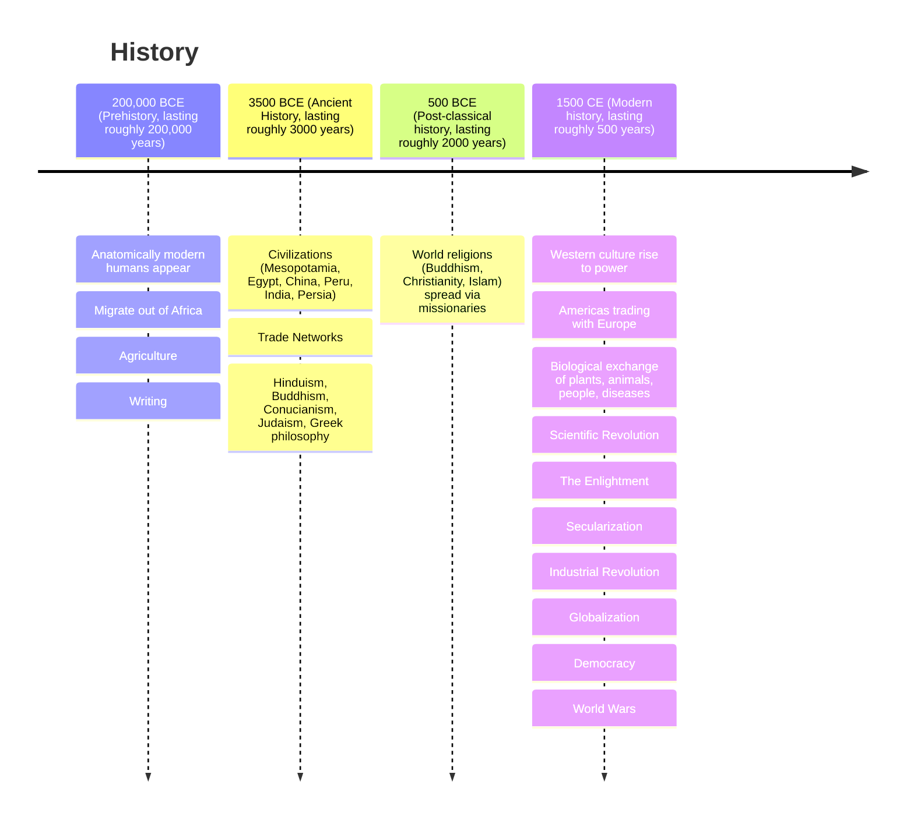

# Introduction

The study of History involves analyzing and interpreting evidence to form a narrative of what happened in the past.

There are different ways of categorizing concepts throughout history, including:

- By time period (e.g. "ancient history")
- By geographical location (e.g. "the history of Greece")
- By themes (e.g. "military history")

This book will focus primarily on categorization by time period.

In this scheme, history is typically divided into these periods:

- Prehistory
- Ancient history
- Post-classical history
- Modern history

The overall arc of (human) history can be roughly summarized thusly:

Humans gradually evolved from human-like species and so we do not have a hard cut off point for when the first human existed. So called "anatomically modern humans" first appeared roughly 200,000 years ago, starting in Africa, and then migrating out of Africa to populate most of the rest of the Earth. They initially led a nomadic lifestyle, based on hunting and gathering. Eventually, they developed agriculture, which led them to switch to a more sedentary lifestyle. They then developed writing, which marks the transition from prehistory to ancient history around 3500 BCE.

Agriculture led to excess foods, which allowed for urbanization or "city building". This also allowed for people to specialize into certain roles and careers, and forms the basis of "society", "civilizations" and "empires".

The transition from ancient history to post-classical history happens around 500 BCE, where major religions begin to take a much more prominent role.

The transition from post-classical history to modern histroy starts around 1500 CE, around when the scientific revolution occured, leading to humanism, the enlightment and secularization.



```flashcard
front: Approximately when would Christopher Columbus have first arrived in America?
back: During the transition between post-classical history and modern history. 1492, to be precise.
```

```flashcard
front: Approximately when would the Bronze Age have occurred?
back: In early ancient history, starting from around 3000 BCE to around 300 BCE, depending on the region.
```

```flashcard
front: Approximately when would the humans have first worked with gold?
back: Prehistory. Depending on what is meant by "worked with", evidence of "free" or "natural" gold use dates as far back as 40,000 BCE. Gold artifacts (which would have required smelting) date as far back as 4,600 BCE in Bulgaria.
```

```flashcard
front: Approximately what period of time is described in the Hebrew Bible (Old Testament)?
back: Ancient history. Creation is roughly dated to 4000 BCE, the great flood around 2300BC, the exodus from Egypt around 1400 BCE.
```

```flashcard
front: Approximately when was papyrus first used for writing?
back: Ancient history, around 2500 BCE, in Egypt.
```